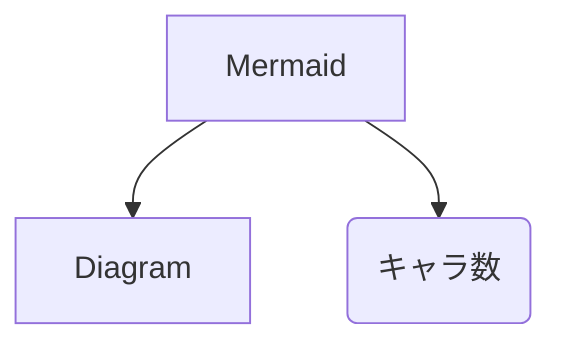
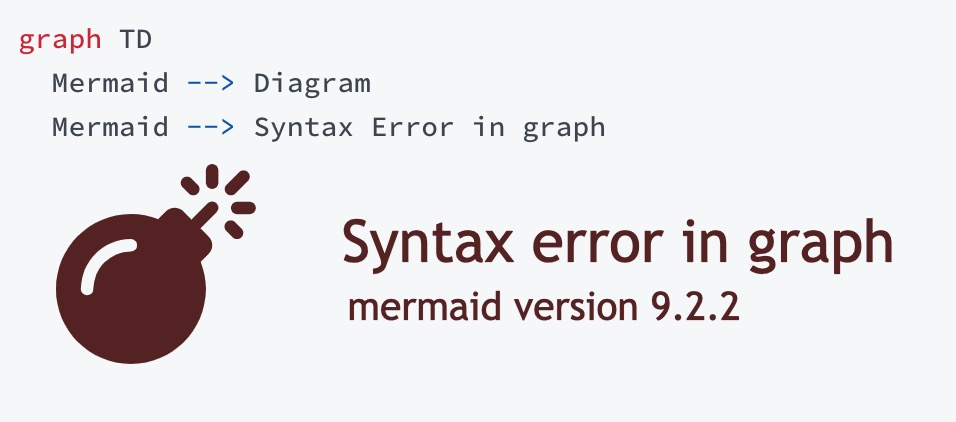

# 📊 Diagram


URL



URL


### D2


URL


### Plant UML


Site



The advantage is to take advantage of the include function


### Plant UML Notation & Usage







### Mermaid Notation & Usage


Site


<mark style="color:purple;background-color:yellow;">GitBook でも編集可能です</mark>

<figure><figcaption>
Syntax error： a_b_c 
</figcaption></figure>


URL


