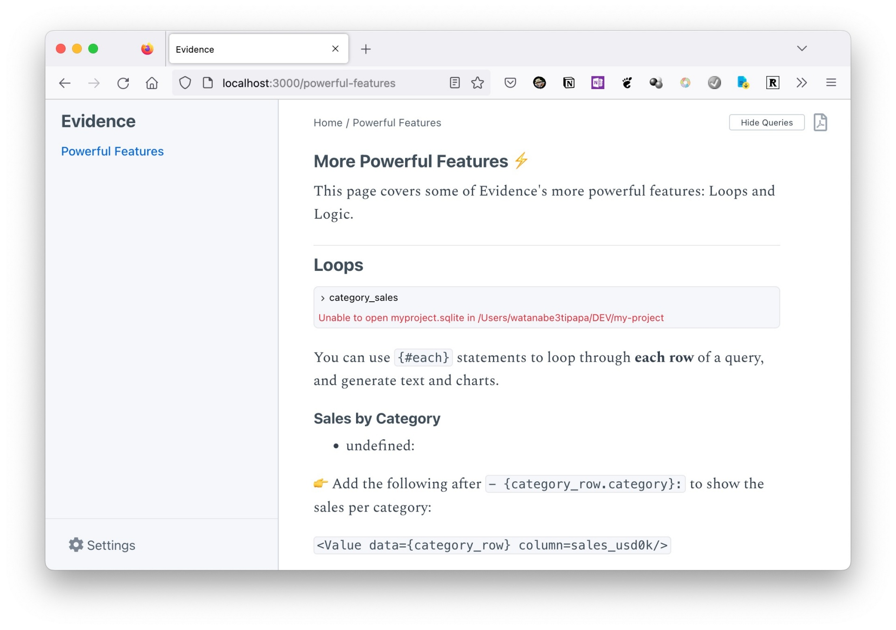

# 💾 Evidence


Evidence は MarkdownにSQLクエリやグラフの設定を記載し、レポート用の静的なHTMLドキュメントを作成するツールです。


**VSCode Extension**

<figure><figcaption>
SS
</figcaption></figure>


URL



URL



Repo


<figure><figcaption>
Localhost:3000
</figcaption></figure>

