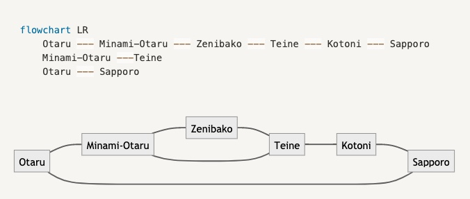

# 📓 Notion


<mark style="background-color:green;">**Stable tools**</mark>


### The notation of NOTION is also unique

## <mark style="background-color:blue;">しくみ</mark>

### 基本

#### 見出し系

\#, (##, ###) + スペース で タイトル(見出し表示)に。\
タイトルの大きさを設定することができます。

見出し系

* H1 (見出し1) : #
* H2 (見出し2) : ##
* H3 (見出し3) : ###

ここで設定した「見出し」を用いて目次を使える機能もあるのですが、これを使えるとさらに便利になります。

#### 箇条書き

箇条書き

「-」＋「スペース」で箇条書き。\
他にも 「\*」や「+」でも代用できます

**次の箇条書きへは？**

「Enter」を押すことで次の行に移ります。

**箇条書きのレベルはどのように調整する？**

Tab キー で 1段下げれます\
Shift + Tab で 逆に 1段上げれます

#### 順序つきの箇条書き

順序つきの箇条書きについては、3種類あります。

いずれも ピリオド(.) + スペースが必要なのは共通で、どのように表示させたいかによって1文字目の入力が変わっていきます。

順序つきの箇条書き

* 「1. 」+ 「スペース」: 数字版 (1, 2, 3)
* 「a. 」+ 「スペース」: アルファベット版 (a, b, c)
* 「i. 」+ 「スペース」: ローマ数字版 (i, ii, iii)\
  入力は アルファベットの i(アイ)で OK。

#### チェックボックス

チェックボックス内をクリックするだけで、チェックができるようになる機能でもあるので便利\
TODOの管理や ちょっとしたチェックリストに最適。

チェックボックス

\[] + スペース

\[] は \[ と ] の大かっこ2つを組み合わせて入力します

#### トグルリスト

トグルリスト

「>」＋「スペース」

#### 引用ブロック

引用を行いたいときに用いることができるブロックです

引用

「"」+ 「スペース」\
引用符である " を用いる記号！と覚えるといいかもしれません\
\
ちなみに、Notionではアップデートによって引用ブロックの中でも 各種装飾(箇条書きなども含め)ができるようになっています。

#### 文中(文字の装飾)

文中 (文字の装飾)まとめ

* \*\*太字\*\* : 太字
* \*イタリック\* : 斜体(イタリック) アルファベットのみ対応
* \`インラインコード\` : 網掛け表示に！ (インラインコード)
* \~取り消し線\~ : 取り消し線を引く

いずれも 文字を (特定の)同じ記号で囲む形で書いていきます。\
上から順に 「\*\*」, 「\*」, 「\`」, 「\~」で囲んでいます。

＝＝＝

## <mark style="background-color:blue;">実践</mark>

### 1．ショートカットキーを活用する

便利テクニックの1つ目はショートカットキーを活用することです。Notionではより効率的に編集を行うためのショートカットキーがたくさん用意されています。

そのため、ショートカットキーを使えるようになるだけで圧倒的に効率よくNotionを使うことができるようになります。

その中でも本記事では、よく使うものだけに絞って紹介していきたいと思います。

#### ショートカットキーを使う際の注意点

**より効率を上げたいという方はアプリをダウンロードして使用する**

Notionのショートカットキーの中には、Webブラウザでは使用できないものが存在するので、よりショートカットキーを使って効率を向上させたいという方は、アプリをダウンロードして試してみてください。\
以下にアプリのダウンロードリンクを添付しておきます。

**ショートカットキーの表記について**

本記事では、Windowsを基準にショートカットを紹介していくため「Ctrl(Controlキー)」という表記を扱っていきます。\
Macの場合は「Ctrl=⌘(commandキー)」となりますので、Macユーザーの方は「Ctrl」の部分を「⌘」に置き換えて本記事をご覧ください。

**パソコンのショートカットキーは省略**

本記事では、Notionでのみに使えるショートカットキーを紹介していきます。そのため「Ctrl + C」,「Ctrl + V」,「Ctrl + Z」,「Ctrl + Shift + Z」などの、どのアプリでも使えるような便利なショートカットキーは省略しています。

#### 便利なショートカットキーの一覧

**Ctrl + N：新しいページを作成する**

このショートカットキーを使うことで【+Add a page】のボタンの動作を行い、新しいページを作成することができます。

**Ctrl + Shift + N：新しいNotionウィンドウを立ち上げる**

このショートカットキーを使うことで新しいNotionウィンドウを立ち上げることができます。\
この動作によって、以下のように複数のNotionページを編集することも可能になります。

**Ctrl + P：Quick Find機能を呼び出す**

このショートカットキーを使うことで、以下の画像のようなQuick Findという機能を呼び出すことができます。\
Quick Find機能を使うことによって、簡単にページを検索して移動することが可能になります。

**Ctrl + \[：1ページ前に戻る、Ctrl + ]：1ページ先に戻る**

これらのショートカットキーを使うと、ページの前後に移動することができます。\
つまり、Webブラウザの以下の赤枠の部分の役割のように動作します。

**Ctrl + Shift + L：表示画面をダークモードに変更する**

このショートカットキーを使うことで、Notionの画面を真っ暗にすることができます。\
暗いところでの作業の際に使うと、非常に効果的です。

**Ctrl + K：テキストにリンクを追加する**

テキストを選択しながらこのショートカットキーを使うことで、テキストにリンクを簡単に追加することができます。

**Ctrl + B：テキストを太字にする**

テキストを選択しながらこのショートカットキーを使うことで、テキストを太字にすることができます。

**Ctrl + E：テキストをインラインコードにする**

テキストを選択しながらショートカットキーをこの使うことで、テキストをインラインコードにすることができます。

このインラインコードという機能は、基本的にはプログラミングのコードを貼り付けるときに使う機能になります。そのためエンジニアの方々のためには非常に重宝する機能になります。

しかし、普段からプログラミングのコードを貼り付ける機会はあまりないと思うので、文字を強調させたいときに使うのが良いと思います。

**Ctrl + Shift + M：コメントを残す**

テキストを選択しながらこのショートカットキーを使うことで、テキストにコメントを残すことができます。

**Tab：インデントをつける**

テキストにカーソルを合わせながらこのショートカットキーを使うことで、インデント(字下げ)をつけることができます。

**Tab + Shift：インデントを戻す**

インデントを使った行を選択しながらこのショートカットキーを使うことで、インデントを元に戻すことができます。

**Esc：現在の位置のブロックを選択する**

テキストにカーソルを合わせながらこのショートカットキーを使うことで、そのブロックを選択することができます。\
つまり、以下の画像の赤枠の部分のショートカットになります。

**Shift + クリック：ブロックの範囲選択を行う**

このショートカットキーを使うことで、特定の範囲のブロックを全て選択することができます。

**Shift + ↑↓：ブロックの範囲選択を行う**

クリックではなく、↑↓キーを使って範囲選択を行うことも可能です。

**Ctrl + D：選択したブロックを複製する**

上記の方法でブロックを選択しながらこのショートカットキーを使うことで、選択していたブロックの複製を行うことができます。

### 2．マークダウン記法を使う

#### マークダウンとは？

マークダウンとは、テキスト上で特定の記号を使うことによって、自動でブロックの表示を変更できる機能になります。Notionではこのマークダウンを使うことによって文字の装飾などを簡略化して、効率よく編集することが可能になります。

ここでもショートカットキーと同じく、よく使うものに絞って紹介したいと思います。

#### 便利なマークダウン記法の一覧

**-(マイナス) ＋ スペース：箇条書きの「・」をつける**

このマークダウン記法を使うことで、簡単に箇条書きを行うことができるようになります。\
Notionでは「+(プラス) + スペース」,「\* + スペース」でも同様の動作を行うことができますが、「-」を使うのが一番簡単でかつ他のアプリにも利用することができるので、「-」を使っていくことをおすすめします。

**1. ＋ スペース：箇条書きの段落番号をつける**

このマークダウン記法を使うことで、簡単に段落番号をつけながら箇条書きを行うことができます。

**\[]：チェックボックス(To-doリスト)を作成する**

このマークダウン記法を使うことで、簡単に以下のようなチェックボックスを作成することができます。

**＞ ＋ スペース：トグルリストを作成する**

このマークダウン記法を使うことで、簡単に以下のようなトグルリストを作成することができます。\
「< + スペース」のように不等号の向きを間違えると何も起こらないので、この点には注意が必要です。

**” ＋ スペース：引用のセクションを作成する**

このマークダウン記法を使うことで、以下のようにテキストの左端に引用のセクションを作成することができます。

**—：区切り線(ディバイダー)を作成する**

このマークダウン記法を使うことで、以下のようにセクションごとに区切るための区切り線を使うことができます。\
セクションごとの境界線を引きたいときに使うと、ページが見やすくなります。

**# ＋ スペース：H1 Headingを作成する**

このマークダウン記法を使うことで、H1 Headingを簡単に作成することができます。

同様に「## + スペース」のマークダウン記法を使用するとH2 Sub-headingを、「### + スペース」を使用するとH3 Sub-headingを作成することができます。

しかし「#### + スペース」以降は何も起こりません。

**@ + ユーザーの名前：他のユーザーにメンションする**

@ の後ろにワークスペース内の他のユーザ名を入力すると、メンションすることができそのユーザに通知を送ることができます。タスクを指定するときや、コメントする際に便利な機能になります。

**@ + ページの名前：ページへのリンクを作成する**

@ の後ろにワークスペース内のページの名前を入力すると、そのページに移動するリンクを作成します。

**@ + 日付：ページへのリンクを作成する**

@ の後ろに日付を入力すると、以下の画像のように日付を指定することができます。\
タスクの納期を指定するときの使える機能となっているので、タスク管理を行う際にはぜひこのマークダウン記法を使ってみてください。

**@ + remind + 日付：リマインダーを設定する**

@の後ろに\[remind]とテキストを入力し、その後ろに日付を入力することでリマインダーを作成することができます。

### 3．スラッシュコマンドを使う

#### スラッシュコマンドとは？

スラッシュコマンドとは「/」の後ろにテキストを入力することによって、特定の動作を行うことができるマークダウン記法の1つになります。

またこのスラッシュコマンドは、先程のマークダウン記法のところで紹介したような動作も行うことができます。動作が被っている部分は、自身の好みで使い分けをするのがおすすめです。

#### 便利なスラッシュコマンドの一覧

**/color(色の名前)：テキストの色を変更する**

テキストの後ろにスラッシュコマンドを使い、色の名前の英語の入力すると、テキストの色が変更されます。

**/page：新しいページを作成し、そのリンクを埋め込む**

このスラッシュコマンドを使うことで、新しいページを作成し、さらにそのページ内に新たに作ったページに移動するリンクも作成することができます。

**/link：ワークスペース内の他のページへのリンクを作成する**

このスラッシュコマンドを使うことで、他のページへのリンクを作成することができます。

**/h1：H1 Headingを作成する**

このスラッシュコマンドを使うことで、「# + スペース」と同様にH1 Headingを作成することができます。

また/h2の場合はH2 Sub-headingを、/h3の場合は、H3 Sub-headingを作成することができます。

**/image：画像ファイルをアップロードする**

このスラッシュコマンドを使うことで、画像ファイルをアップロードすることができます。\
他にも、/pdf,/video,/audioと入力することで、PDFファイルや動画ファイル、音声ファイルなども埋め込むことが可能です。

### 4．埋め込み機能を使う

#### Notionの埋め込み機能について

Notionでは、画像ファイルやPDFファイルに関してはもちろん埋め込むことができますが、それら以外にもGoogle DriveやGoogle Mapなどの外部サービスの埋め込みも行うことができます。そのため、少し操作を行うだけで簡単に外部サービスとの連携も行うことができます。

また、Notionに埋め込みをできる外部サービスの一覧については以下のURLから確認することができます。

> URL（検証中）

#### 埋め込み機能を使う方法

Notionの埋め込み機能は、ブロックの左にある 「+」のボタンの「Embed」をクリックすることによって選択することができます。

そしてこの操作によって表示されるところからURLまたはファイルを添付すればページに機能を埋め込むことができます。試しにGoogle Mapを埋め込むと以下のように表示されます。

#### 埋め込み機能のショートカット

Notionの埋め込み機能はスラッシュコマンドを使って、ショートカットを行うことができます。基本的にこれらの操作はURLをコピー&ペーストを行うだけで大丈夫です。以下によく使用するショートカットを載せておきます。

* /embed：ファイルや外部サービスを埋め込む(万能なショートカット)
* /map：Google Mapを埋め込む
* /drive：Google Driveを埋め込む
* /tweet：Twitterのツイートを埋め込む

### 5．テンプレートを利用する

Notionでは、初めて使うという方でも使いこなせるようにテンプレートがたくさん用意されています。そのため、このテンプレートを上手く扱うことによって、より効率よく目的に沿ってNotionを使うことができるようになります。

#### Notionが用意しているテンプレートを利用する方法

**1. テンプレートのタイトルが分かるように日本語表示にする**

まず、テンプレートをいきなり使おうと思っても、そのテンプレートのタイトルの英語が難しいのでまず使えません。なので現在(2021年10月地点)ではベータ版の日本語表示機能を使って、日本語に変更します。

変更する方法としては、まずNotion画面の左上にある【Setting & Members】 をクリックします。

そして「Language & region」をクリックします。

次に「English」と書かれている部分をクリックし「日本語」を選択します。

そして「Update」を選択すれば、日本語表示化の完了です。

**2. 用意されているテンプレートを目的に沿って探す**

Notionのテンプレートを使うにはまず、表示画面の【テンプレート】をクリックします。

すると以下のような画面の移動します。そこで、赤枠の部分にテンプレートのカテゴリーが表示されているのでそこから自分が使いたいと思うテンプレートを選びます。\
そして右上にある青色の【このテンプレートを使用する】をクリックすると、そのテンプレートを使うことができるようになります。

テンプレートは自分で自由にカスタマイズすることもできるので、より自分が使いやすい形にして使ってみてください。

#### 他のユーザーが作ったテンプレートを利用する方法

Notionでは初めから用意されているテンプレートだけでなく他の人が作ったページもテンプレートとして使用することができます。ネットには、様々な人がNotionテンプレートを提供してくれているため、その人たちのテンプレートを簡単に利用することができます。

~~方法としては、まず以下のURLから~~

<mark style="background-color:red;">後日追記</mark>

~~~~

自分が使いたいテンプレートを選択し、「テンプレート」と書かれている部分の下のテキストをクリックします。

するとそのテンプレートのページに移動することができるので、そのページの右上にある【複製】(または【duplicate】)をクリックします。

すると、自分のワークスペースにテンプレートが複製されています。

Web上には日本で使われているテンプレートだけでなく、実際に海外で使われているテンプレート集も存在していますので、気になる方は以下のURLから調べてみてください。

[【Notion公式】海外テンプレート集](https://www.notion.so/Notion-Template-Gallery-181e961aeb5c4ee6915307c0dfd5156d)

#### mermaid などは　code block で編集できます

### 6.   万能なショートカット（embed：について

<mark style="background-color:red;">後日追記</mark>

### 7．コメント

圧倒的にNotionを効率よく使うための便利テクニックを紹介してきました。

これらのテクニックを使えるようになるだけでNotionの生産性をしっかりと向上させることができます。

覚えることは多いですが毎日少しずつ実践していきながら習得していくしかありません。

<mark style="background-color:red;"></mark>

<mark style="background-color:red;"></mark>

\
\

