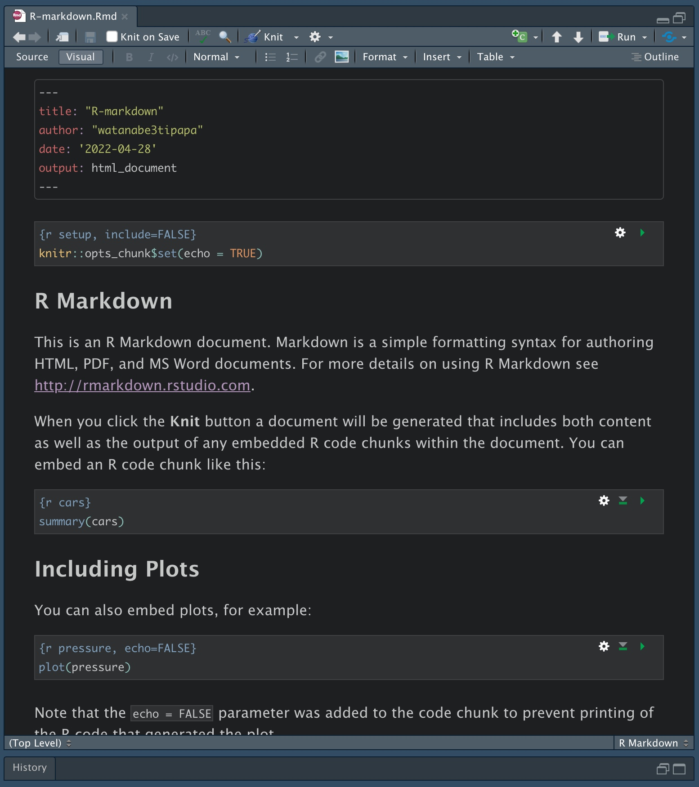

# 🔜 R




### RStudio



### flexdashboardパッケージ

#### flexdashboardのインストール

* CRANから

```
install.packages("flexdashboard")
```

* GitHub版から

```
devtools::install_github("rstudio/flexdashboard")
```

* githubinstallから

```
githubinstall::githubinstall("flexdashboard")
```






### Link






R



GitHub





