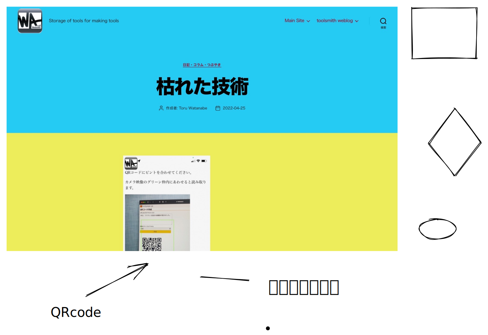

# 📋 sketchbook

### ちょっと落書き


<mark style="background-color:blue;">**Drawing**</mark>




<mark style="background-color:blue;">**`Code Block`**</mark>

```
/*
 * Allocate NMEMB instances of SIZE bytes and return the pointer, or error on
 * integer overflow.
 */
void *
grub_calloc (grub_size_t nmemb, grub_size_t size)
{
  void *ret;
  grub_size_t sz = 0;

  if (grub_mul (nmemb, size, &sz))
    {
      grub_error (GRUB_ERR_OUT_OF_RANGE, N_("overflow is detected"));
      return NULL;
    }

  ret = grub_memalign (0, sz);
  if (!ret)
    return NULL;

  grub_memset (ret, 0, sz);
  return ret;
}
```


<mark style="background-color:blue;">**Table**</mark>

<table><thead><tr><th width="150" data-type="checkbox"></th><th data-type="number"></th><th width="150" data-type="select"></th><th></th><th></th><th></th><th></th></tr></thead><tbody><tr><td>true</td><td>null</td><td></td><td></td><td></td><td></td><td></td></tr><tr><td>true</td><td>null</td><td></td><td></td><td></td><td></td><td></td></tr><tr><td>true</td><td>null</td><td></td><td></td><td></td><td></td><td></td></tr><tr><td>true</td><td>null</td><td></td><td></td><td></td><td></td><td></td></tr></tbody></table>


<mark style="background-color:blue;">**Math & TeX**</mark>

$$
f(x) = x * e^{2 pi }
$$

$$
e = m* c^2
$$

<mark style="background-color:blue;">**API method**</mark>







*

<mark style="background-color:blue;">**Open API**</mark>

/


<mark style="background-color:purple;">**external link**</mark>

> caution&#x20;
>
> 以下は、リンクを示すものであり、当該の方法でColabに接続することは禁じられています


GitHub



Google Drive



