```mermaid
```

```mermaid
graph TD
  Mermaid --> Diagram
  Mermaid --> Syntax_error_("キャラ数")
 
```

# 📊 UML

Plant UML


Site



The advantage is to take advantage of the include function


### Plant UML Notation & Usage







### Mermaid Notation & Usage


Site


<mark style="color:purple;background-color:yellow;">GitBook でも編集可能です</mark>

<figure><figcaption>
Syntax error： a_b_c 
</figcaption></figure>

