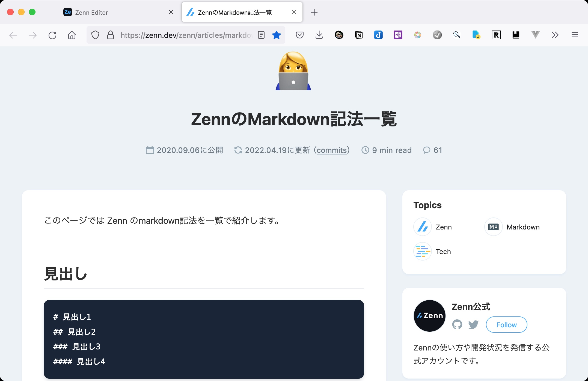

# 🖊 Zenn

### Zenn Editor を導入します

> インストール時はルートディレクトリ（推奨）

```javascript
// javascript
npm init --yes # プロジェクトをデフォルト設定で初期化
npm install zenn-cli # zenn-cliを導入
```

＊作業ディレクトリ（任意）に cd してください

```javascript
// javascript
npx zenn init
```


```shell
// sh　　（3333指定）
npx zenn preview --port 3333

```



